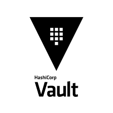

<!SLIDE title-slide>

# Hackathon Team 3 

## Classroom Training Deployments

### Team Members

`John Dohoney, Tyler Walker, Gonzalo Lopez, Roger Chao`

### Technologies

```Infrastructure: ie GCP, GKE, Terraform```

```Service Configuration and Service Discovery: Consul```

```Application: Front end portal + Showoff (OSS application) + Wetty```

### Business Case

Delivering classroom technical training requires travel to and from locations. This can be costly and also often requires students to download software that often does not involve the solution being taught. Attempts at fixing this problem are often one off solutions that don’t repeatability scale and lead to poor learning experience. This is a problem for online colleges, companies and partners delivering training solutions. 
Description
Team 3 plans to build a classroom training experience that enables teacher to repeatedly deploy training environments. This will eliminate the complexity and allow them to focus on delivering quality training for the students. 

The training solution will have a frontend student sign-up and will integrate with Terraform to provision the classroom. This will include the training application itself, which will  be running on K8s and backed by a repo which will serve the content for the class. Additionally, wetty containers to forward SSH sessions via browser to VMs that will have the needed tooling for student exercises. All of the K8s services will be registered with Consul and will run health checks across the class environment.

<!SLIDE bullets incremental transition=fade>
# Architecutre
* Sometimes bullet items
  * Have sublists
  * And some sublist items
    * Have some of their own
    * And so on
* But top-level "bullet items" have no bullets
  * isn't that odd?

# Super Official Vault Training



## Agenda

## * Teach you Vault!
## * You will learn it!
## * You will like it!

!SLIDE commandline incremental
## Vault Dyanamic Secret Example

	$ vault secrets enable database
	Success! Enabled the database secrets engine at: database/
	
	
	$ vault write database/config/postgres \
	$ plugin_name=postgresql-database-plugin \
	$ allowed_roles=readonly \
	$ connection_url="user=roger password=password123 \
	$ host=localhost port=5432 dbname=supercoolapp sslmode=disable"
	Success! 
	
~~~SECTION:notes~~~
This is a presenter note example. I have no idea what I'm doing
~~~ENDSECTION~~~

<!SLIDE bullets>
# Third Slide

@@@ render-diagram
<!DOCTYPE html>
<html lang="en">
<head>
  <meta charset="utf-8">
  <link rel="stylesheet" href="mermaid.min.css">
</head>
<body>
  <div class="mermaid">
  graph LR
      A --- B
      B-->C[fa:fa-ban forbidden]
      B-->D(fa:fa-spinner);
  </div>
  <script src="mermaid.min.js"></script>
  <script>mermaid.initialize({startOnLoad:true});</script>
</body>
</html>
